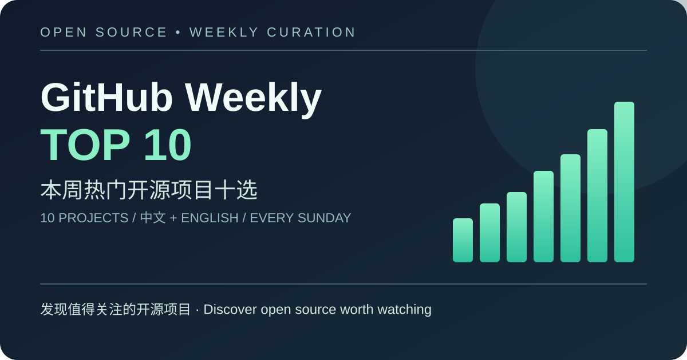

# GitHub 本周热门开源项目十选 / GitHub Weekly Open Source Top 10

每周精选 GitHub Trending 的 10 个热门开源项目，以中文和英文介绍，并附上项目链接、数据和可视化图表。  
A weekly selection of 10 popular open-source projects from GitHub Trending, with Chinese and English summaries, source links, metrics, and a visual chart.

## 最新一期 / Latest issue

尚未发布。首期计划于北京时间 2026 年 9 月 27 日（周日）20:00 生成。  
Not published yet. The first issue is planned for Sunday, September 27, 2026 at 20:00 Asia/Shanghai.

<!-- LATEST_ISSUE_START -->
<!-- LATEST_ISSUE_END -->

## 往期目录 / Archive

<!-- ARCHIVE_START -->
<!-- ARCHIVE_END -->

## 选取方法 / Methodology

- 来源 / Source: [GitHub Trending — this week](https://github.com/trending?since=weekly).
- 每期按抓取时页面顺序选前 10 个真实、公开的开源仓库；如有无效条目，记录原因后顺延。 / Each issue follows the page's ranking at capture time and selects the first 10 valid public open-source repositories; invalid entries are skipped with a recorded reason.
- “本周”指发布时的最近 7 天；周报注明抓取时间（Asia/Shanghai）和 GitHub Trending 显示的本周新增 Star 数。 / “This week” means the trailing seven days at publication time. Each issue records the capture time in Asia/Shanghai and the weekly star gain shown by GitHub Trending.
- 数据随时间变化；每期保留发布时的快照。 / Metrics change over time; each issue preserves a publication-time snapshot.
- 项目名称、描述、许可和图片归各原项目所有；本仓库只做资料整理并链接原出处。 / Names, descriptions, licenses, and images belong to their respective projects; this repository curates information and links to the originals.

## 自动化说明 / Automation

任务说明见 [AUTOMATION_PROMPT.md](AUTOMATION_PROMPT.md)。  
The recurring task specification is in [AUTOMATION_PROMPT.md](AUTOMATION_PROMPT.md).
